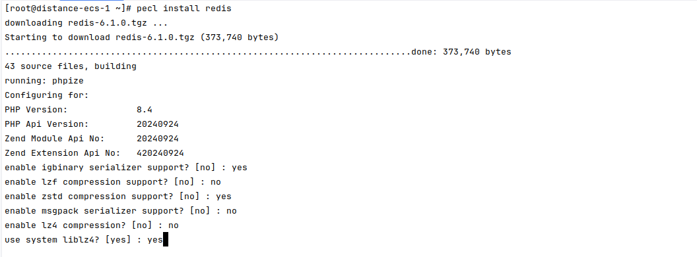
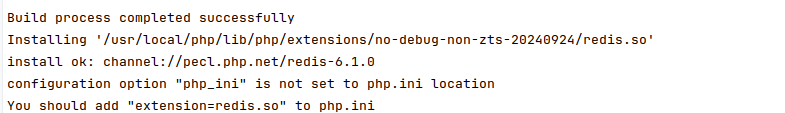

## PECL 安装 redis

#### 需要先安装 igbinary
```shell
    pecl install igbinary
```

#### 1. 执行命令
```shell
    pecl install redis
```
#### 2. 按照如图所示配置



#### 3. 当出现如下图输出时，说明安装成功


#### 4. 修改 php.ini
```
extension=redis
```

#### 5. 重启 php-fpm
```shell
    sudo systemctl restart php-fpm
```
